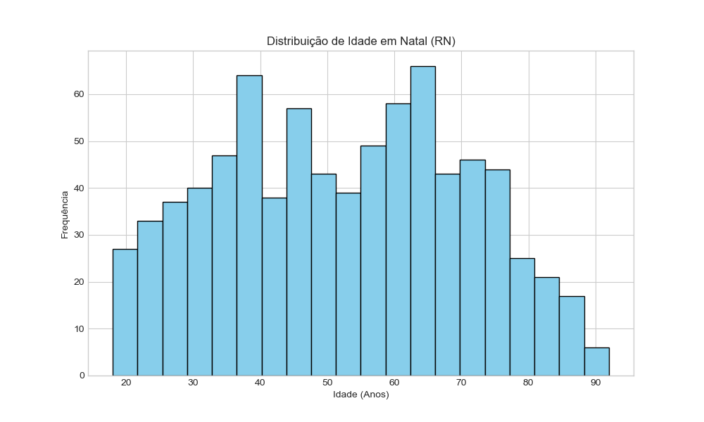
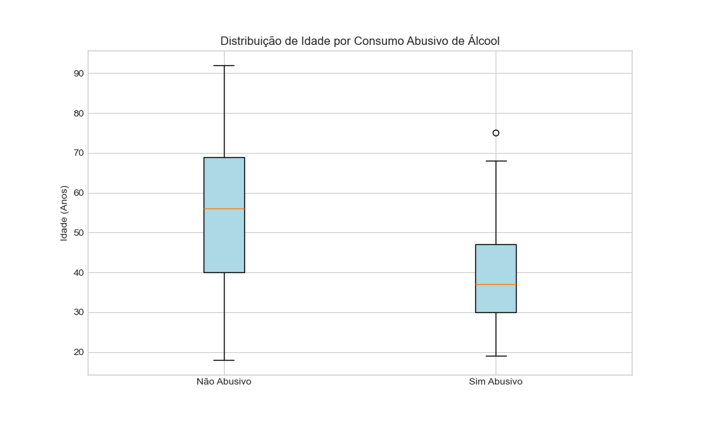
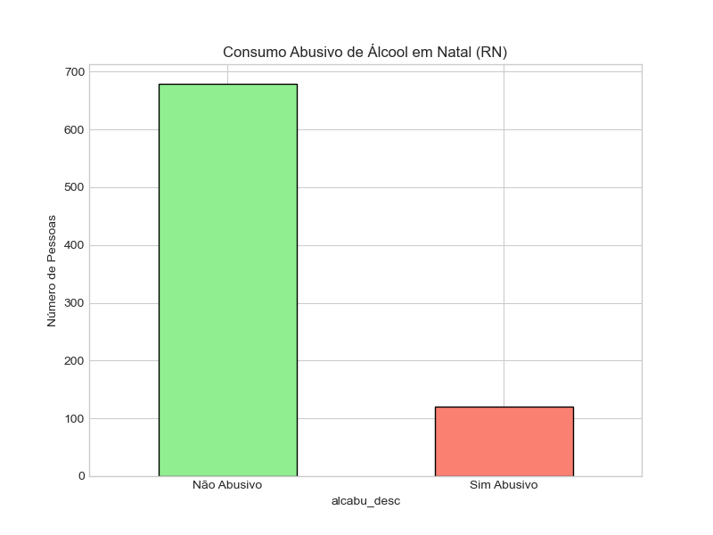
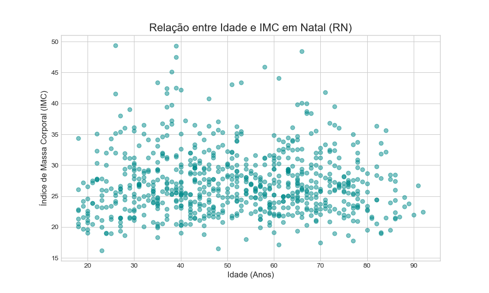

# Análise de Saúde (VIGITEL): Relação entre "Imposto do Pecado" e Segurança Alimentar em Natal/RN

> **Descrição:** Análise exploratória (EDA) dos microdados VIGITEL focado em Natal (RN). Investiga a correlação entre consumo de produtos nocivos (álcool, tabaco, ultraprocessados) e indicadores de dieta saudável. Incluiu limpeza de dados, seleção estratégica de variáveis e correção de viés metodológico com Pandas/Anaconda.

Este projeto é uma análise exploratória de dados (EDA) dos microdados da pesquisa VIGITEL, com foco na população da cidade de Natal (RN). O objetivo é investigar a correlação entre o consumo de produtos nocivos à saúde (como tabaco, álcool e ultraprocessados) e indicadores de segurança alimentar (como o consumo de hortaliças).

Este foi meu primeiro projeto completo de análise de dados realizado no ambiente Anaconda/Jupyter, cobrindo todo o ciclo de vida do dado.

## 📈 Principais Insights (Resultados)

A análise revelou um "clustering de comportamentos de risco":

1.  **Ultraprocessados vs. Hortaliças:** Pessoas com "Alto Consumo de Ultraprocessados" são mais propensas a *não* consumir hortaliças regularmente (70.6%) em comparação com o grupo de "Baixo Consumo" (59.8%).
2.  **Álcool vs. Ultraprocessados:** O grupo com consumo abusivo de álcool tem maior chance de também ter um alto consumo de ultraprocessados (24.0%) em comparação com o grupo sem consumo abusivo (14.3%).
3.  **Fumo vs. Ultraprocessados:** Fumantes também são mais propensos a ter um alto consumo de ultraprocessados (20.7%) do que os não fumantes (15.1%).

## 🖼️ Visualização de Dados

| Histograma de Idade | Boxplot: Idade vs. Álcool |
| :---: | :---: |
|  |  |

| Gráfico de Barras: Álcool | Gráfico de Dispersão: Idade vs. IMC |
| :---: | :---: |
|  |  |

## 🛠️ Metodologia

1.  **Configuração:** Ambiente Anaconda com Jupyter Notebook e Pandas.
2.  **Coleta de Dados:** Microdados brutos e dicionários do VIGITEL.
3.  **Preparação e Limpeza (Wrangling):**
    * Carregamento dos dados (`.xlsx`) no Pandas.
    * Seleção estratégica de variáveis.
    * **Identificação e Correção de Viés Metodológico:** Foi identificado que a coluna `q82` (refrigerante) introduzia um viés de seleção (provavelmente só aplicada a mulheres). A coluna foi removida para preservar a integridade da amostra, resultando em 800 entrevistas válidas (homens e mulheres).
    * Tratamento de *outliers* na coluna `imc`.
4.  **Análise Exploratória (EDA):**
    * Cálculo de estatísticas descritivas (`.describe()`).
    * Criação de tabelas de contingência (`pd.crosstab`).
    * Geração de visualizações com Matplotlib.
